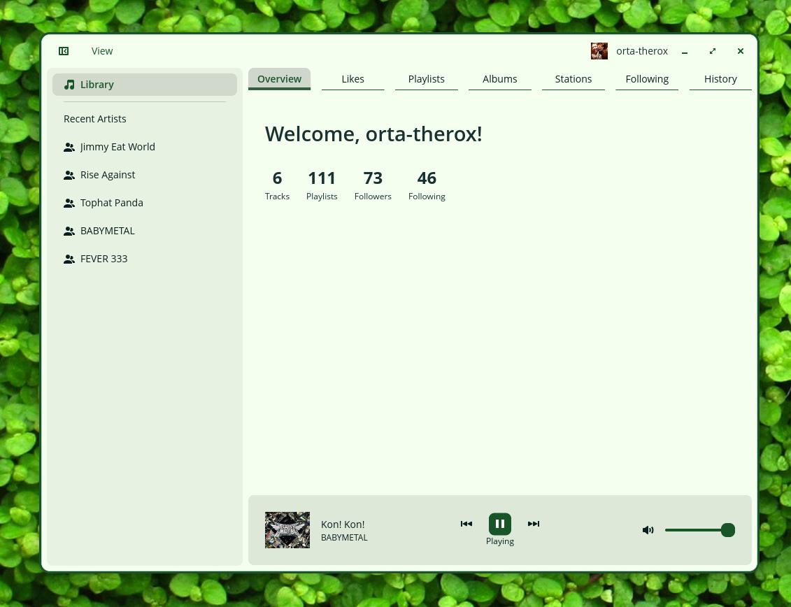
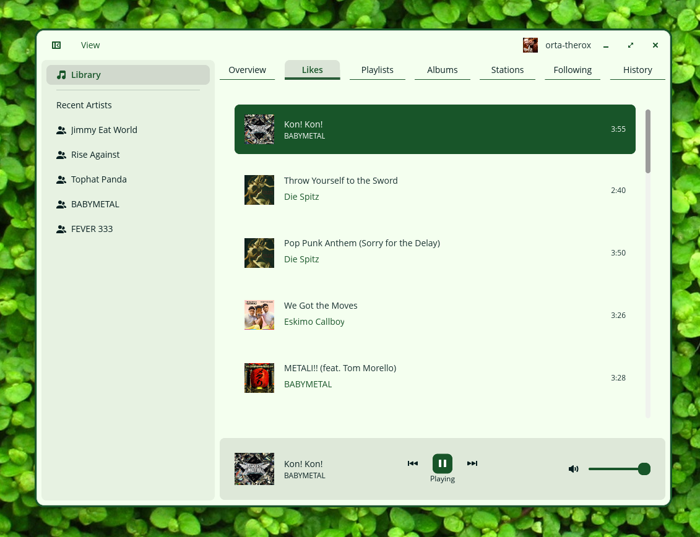
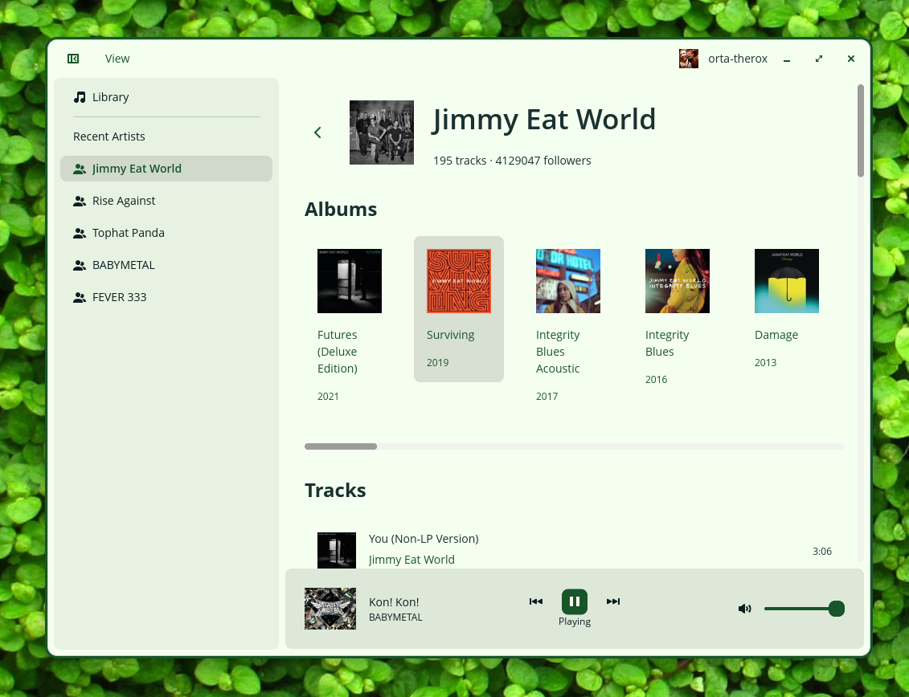

# Cosmic Soundcloud

A native SoundCloud client for the COSMIC desktop environment.

## Features

- Browse your SoundCloud library with your liked tracks and listening history
- Play tracks with a built-in audio player (with playlist support and auto-advancement)
- View artist pages with their albums and tracks
- Quick access to recently visited artists in the sidebar







## Installation

A [justfile](./justfile) is included by default for the [casey/just][just] command runner.

- `just` builds the application with the default `just build-release` recipe
- `just run` builds and runs the application
- `just install` installs the project into the system
- `just vendor` creates a vendored tarball
- `just build-vendored` compiles with vendored dependencies from that tarball
- `just check` runs clippy on the project to check for linter warnings
- `just check-json` can be used by IDEs that support LSP

## Translators

[Fluent][fluent] is used for localization of the software. Fluent's translation files are found in the [i18n directory](./i18n). New translations may copy the [English (en) localization](./i18n/en) of the project, rename `en` to the desired [ISO 639-1 language code][iso-codes], and then translations can be provided for each [message identifier][fluent-guide]. If no translation is necessary, the message may be omitted.

## Packaging

If packaging for a Linux distribution, vendor dependencies locally with the `vendor` rule, and build with the vendored sources using the `build-vendored` rule. When installing files, use the `rootdir` and `prefix` variables to change installation paths.

```sh
just vendor
just build-vendored
just rootdir=debian/cosmic-soundcloud prefix=/usr install
```

It is recommended to build a source tarball with the vendored dependencies, which can typically be done by running `just vendor` on the host system before it enters the build environment.

## How Audio Playback Works

The app uses a background audio player thread that receives commands via async channels. Here's the playback flow:

1. Stream URL Resolution: When you play a track, the app requests stream URLs from SoundCloud's API. Tracks have multiple "transcodings" (stream formats) - the app prefers HLS streams, then progressive (direct) streams.

2. Audio Player: The [`AudioPlayer`](src/audio/player.rs) runs in a dedicated thread using [rodio][rodio] for audio output. It communicates with the main app via `AudioCommand` and `AudioEvent` message channels.

3. Stream Types:

   - Progressive streams: Direct MP3/MP4 files streamed using [`stream-download`][stream-download] for buffered playback
   - HLS streams: The app downloads all `.m3u8` playlist segments, concatenates them in memory, then decodes and plays the result

4. **DRM Handling**: Some tracks use encrypted HLS (PlayReady/Widevine DRM). When detected, the app falls back to [yt-dlp][yt-dlp] to extract an unencrypted stream URL. If that fails, it offers to open the track in your browser.

[rodio]: https://github.com/RustAudio/rodio
[stream-download]: https://github.com/aschey/stream-download-rs
[yt-dlp]: https://github.com/yt-dlp/yt-dlp

## Developers

Developers should install [rustup][rustup] and configure their editor to use [rust-analyzer][rust-analyzer]. To improve compilation times, disable LTO in the release profile, install the [mold][mold] linker, and configure [sccache][sccache] for use with Rust. The [mold][mold] linker will only improve link times if LTO is disabled.

## Releasing

The project uses GitHub Actions for automated releases. Three workflows handle CI and deployment:

### Continuous Integration

On every push and PR to `main`/`dev`, the [CI workflow](.github/workflows/ci.yml) runs:

- Linting (`cargo clippy`)
- Build verification
- Tests

### Creating a Release

Use the release script to create a new release:

```bash
./scripts/release.sh
```

The script will:

1. Ask you for the new version number
2. Ask you for release notes (one item per line)
3. Update `Cargo.toml` with the new version
4. Add release notes to the metainfo file
5. Create a commit and tag

After the script completes, push the changes:

```bash
git push && git push origin v<version>
```

The [release workflow](.github/workflows/release.yml) will automatically:

- Build a `.deb` package for Debian/Ubuntu
- Build a `.flatpak` bundle
- Create a GitHub Release with both artifacts
- Extract release notes from the metainfo file

### Flatpak Repository

The [flatpak-repo workflow](.github/workflows/flatpak-repo.yml) publishes the Flatpak to GitHub Pages on each release, creating a Flatpak repository users can add:

```bash
flatpak remote-add --if-not-exists cosmic-soundcloud https://orta.github.io/cosmic-soundcloud
flatpak install cosmic-soundcloud com.github.orta.cosmic-soundcloud
```

Note: You'll need to enable GitHub Pages in your repository settings (Settings → Pages → Source: GitHub Actions).

[fluent]: https://projectfluent.org/
[fluent-guide]: https://projectfluent.org/fluent/guide/hello.html
[iso-codes]: https://en.wikipedia.org/wiki/List_of_ISO_639-1_codes
[just]: https://github.com/casey/just
[rustup]: https://rustup.rs/
[rust-analyzer]: https://rust-analyzer.github.io/
[mold]: https://github.com/rui314/mold
[sccache]: https://github.com/mozilla/sccache
